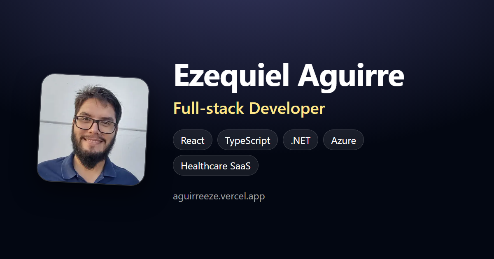

# Ezequiel Aguirre — Portfolio

Personal portfolio of **Ezequiel Aguirre**, Full-stack Developer (React · TypeScript · .NET · Azure) based in Buenos Aires, Argentina.

🌐 **Live:** https://aguirreeze.vercel.app · 📄 [CV (PDF)](public/Ezequiel_Aguirre_CV.pdf) · 💼 [LinkedIn](https://www.linkedin.com/in/ezequiel-aguirre-774321218/)



## Features

- Bilingual site (English / Spanish) with Astro's i18n routing: `/en/` and `/es/`
- Sections for experience, projects and an About section
- Static output with near-zero JavaScript. Lighthouse (mobile): 100 for Accessibility, Best Practices and SEO
- SEO: canonical and `hreflang` links, Open Graph and Twitter cards, JSON-LD `Person` schema, `robots.txt` and `sitemap.xml`
- CV and social preview image generated from HTML with headless Chrome, so they're easy to keep up to date

## Tech stack

- [Astro 4](https://astro.build)
- [Tailwind CSS 3](https://tailwindcss.com)
- TypeScript
- Deployed on [Vercel](https://vercel.com)

## Project structure

```text
├── cv/                    # CV source (cv.html) + build script → public/Ezequiel_Aguirre_CV.pdf
├── scripts/og/            # Social preview source (og.html) + build script → public/og.png
├── public/                # Static assets (images, CV, robots.txt, sitemap.xml)
└── src/
    ├── components/        # Hero, Experience, Projects, AboutMe, icons…
    ├── i18n/ui.ts         # All texts, in English and Spanish
    ├── layouts/Layout.astro  # <head>: SEO meta, Open Graph, JSON-LD
    ├── pages/             # /en and /es routes (/ redirects to /en)
    └── screens/HomePage.astro
```

## Commands

| Command           | Action                                                     |
| :---------------- | :--------------------------------------------------------- |
| `npm install`     | Install dependencies                                       |
| `npm run dev`     | Start the dev server at `localhost:4321`                   |
| `npm run build`   | Type-check (`astro check`) and build to `./dist/`          |
| `npm run preview` | Preview the production build                               |
| `npm run cv`      | Regenerate `public/Ezequiel_Aguirre_CV.pdf` from `cv/cv.html` |
| `npm run og`      | Regenerate `public/og.png` from `scripts/og/og.html`       |

`npm run cv` and `npm run og` need Chrome or Edge installed. If it isn't in the default location, set `CHROME_PATH`.

## Editing content

- **Texts** (hero, experience, projects, About) are in `src/i18n/ui.ts`. Keys missing in `es` fall back to `en`.
- **Projects and tags** are in `src/components/Projects.astro`.
- **"Open to work" badge:** toggle `SHOW_OPEN_TO_WORK` in `src/components/Hero.astro`.
- If the domain changes, update `site` in `astro.config.mjs`, `public/robots.txt` and `public/sitemap.xml`.

## Contact

aguirre.eze95@gmail.com
